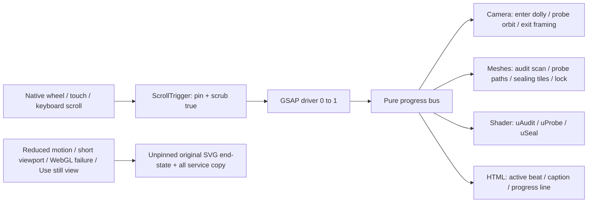

# Cyber Ethos Services scroll upgrade

## Scope
Only the service-list middle of the current founder homepage changes. Hero, Foundation, Approach, Conversation, Newsletter (including Brevo iframe and fallback), footer, branding and portrait remain unchanged. Exact existing service copy and `/review?service=…` destinations are preserved. No deployment or form submissions are part of this implementation.

Original brief: `BRIEF.md`. Reference: illoca.com interaction architecture, NOT its art/code/assets. All scene meshes are original procedural Three.js geometry; the static SVG is also original. No downloaded GLB, textures, or illoca assets. This is a stylized workstation illustration, not a photorealistic human or a live security assessment.

## Architecture
- Existing Next.js/React stack retained.
- Native scroll owns page position, keyboard, touch, anchor and restoration behavior. No second scroll owner or scroll hijacking; Lenis is deliberately not added. ScrollTrigger provides reversible normalized scrub.
- One contiguous pinned service stage contains enter + three beat segments rather than separate nested pins (avoids pin jumps). `scrub: true` maps native position to a GSAP driver from 0 to 1.
- `progress.ts` owns a pure normalized state and subscription bus, independent of React, DOM, GSAP and Three.js.
- `workstation.ts` draws camera, meshes and original screen shader exclusively from bus state. No frame-based accumulation: backward scrolling reverses every channel.
- `ServicesExperience.tsx` owns lazy enhancement, ScrollTrigger, semantic service copy and cleanup.
- The WebGL/GSAP chunk is requested when within 500px of the stage. Draw only on progress/resize, not a perpetual animation loop; DPR is capped at 1.75 desktop / 1.25 narrow viewports.

## Master timeline diagram


| Master | Local channel | Camera / mesh | Shader / HTML |
|---|---|---|---|
| 0–0.10 | enter 0–1 | Open bays, exposed red indicators, camera approaches | Initial exposed screen; Audit label |
| 0.10–0.40 | audit 0–1 | Scan ring rises through workstation; inventory/exposure | `uAudit`: screen scan; Audit active |
| 0.40–0.70 | probe 0–1 | Scoped paths grow, camera shifts, partial patches | `uProbe`: inspection wipe; Penetration Testing active |
| 0.70–1.00 | seal 0–1 | Tiles finish closing, paths fade, lock appears | `uSeal`: monitored green screen; Website Vulnerability Detection active |

Default pin start: stage top at 76px. Total pin travel: viewport height × 3.2. Enter is intentionally inside the same master timeline. Static Approach follows; authorization note stays immediately after Services.

## Retarget a service beat without breaking scrub
1. Keep the three real service identities and canonical review slugs in `FounderLinkHubClient.tsx`. Copy changes are separate from animation changes.
2. Adjust phase bounds ONLY in `progress.ts` (`PHASES`) and align beat selection boundaries in `mapProgress`. Bounds must remain contiguous, monotonic, inside 0–1.
3. Map each channel as `clamp((master - start) / (end - start))`; never increment state based on previous frames. This preserves reverse scrolling and resize restoration.
4. Change the corresponding `draw(p)` expression in `workstation.ts`. Camera, mesh visibility, scale and shader uniforms must depend only on normalized phase state. Ensure all sealing tiles reach scale 1 at final progress.
5. Adjust matching caption in `ServicesExperience.tsx`; keep meaningful information in HTML, not canvas alone.
6. Do not create another RAF loop, Lenis instance or nested pin. If adding Lenis later, bridge it to this single ScrollTrigger owner and tear it down on reduced motion/unmount.
7. Run unit tests, production build and browser acceptance; scrub down AND back up, resize, toggle still view, check narrow and short screens and reduced motion.

## Fallback and accessibility
Server-rendered original SVG shows a monitored end-state. All three service descriptions are available without WebGL or JavaScript. `prefers-reduced-motion: reduce` and viewport height ≤660px skip WebGL/pinning entirely. The in-page still toggle removes renderer, observers and pin; runtime reduced-motion changes disable motion. WebGL context loss shows the same fallback. All service links remain semantic, keyboard-focusable HTML. No autoplay audio. The scene explicitly says improved posture is not invulnerability.

The fallback is intentionally a simplified SVG view, not a bitmap screenshot of the exact 3D camera. Reduced motion never scrubs. Re-enabling after a runtime media-preference change can use the still-view toggle or reload.

## Run / verify
```sh
npm ci
npm run build
npm run start -- --hostname 127.0.0.1 --port 3187
node --experimental-strip-types --test tests/*.test.*
# In another terminal; requires Playwright and Chromium
/Users/agent47/AI-Agent-Workstation/.venv/bin/python tests/scroll_browser.py
```
`PREVIEW_URL` can override the default loopback test URL. Browser tests never submit newsletter or review forms. Evidence is saved to `evidence/scroll-upgrade/` (local, not deployment assets). Build uses existing project Node dependencies. Loopback preview is accessible on the Mac only; no tunnel or public deployment is implied.
